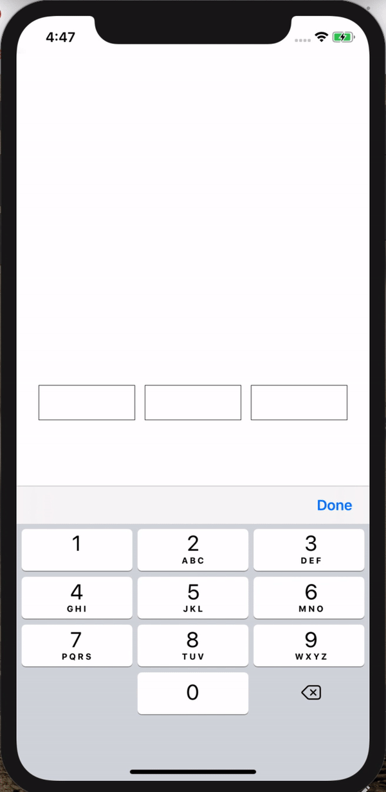

<h1 align="center">
  🚩 Confirm Code Input
</h1>

<div align="center">

Confirm Code Input for React Native

</div>

<p align="center" >
 <kbd>
    
  </kbd>
  <em>Confirm Code Input example app.</em>
</p>

## Usage

**Note: You must be using React Native 0.60.0 or higher to use the most recent version of `@rabiloo/react-native-confirm-code-input`.**

<br>

```bash
yarn add @rabiloo/react-native-confirm-code-input
```

OR FROM GIT

```bash
yarn add https://github.com/rabiloo/react-native-confirm-code-input.git
```

```jsx
import React, { useRef } from "react";
import { AppConfirmCodeInput } from "@rabiloo/react-native-confirm-code-input";

export default function App() {
  const otp = useRef("");

  const onCodeChange = (text) => {
    otp.current = text;
    console.log("text", text);
  };

  const onDone = () => {
    alert(otp.current);
  };

  return (
    <View>
      <AppConfirmCodeInput
        wrapperStyle={{ padding: 20 }}
        textInputStyle={{ fontSize: 20 }}
        codeLength={3}
        codeInputLength={4}
        onCodeChange={onCodeChange}
        onDone={onDone}
        secureTextEntry={false}
        autoFocus={true}
      />
    </View>
  );
}
```

## Properties for `<AppConfirmCodeInput />`

### `wrapperStyle?: object`

Style for wrapper component

---

### `textInputStyle?: object`

Style for text input

---

### `codeLength?: number`

Number of cell

---

### `codeInputLength?: number`

Max length of text input

---

### `onCodeChange: function`

Callback that is called when the text input's text changes. Changed text is passed as a single string argument to the callback handler.

---

### `onDone: function`

Callback function called when fulfilling code at the last cell.

---

### `secureTextEntry: boolean`

If true, the text input obscures the text entered so that sensitive text like passwords stay secure. The default value is false

---

### `autoFocus: boolean`

If true, focuses the input after the screen's rendering. The default value is false.

---

##

This simplifies the development and the testing of the project.

If you require new features or bug fixes for older versions you can fork this project.

## Licenses

MIT
